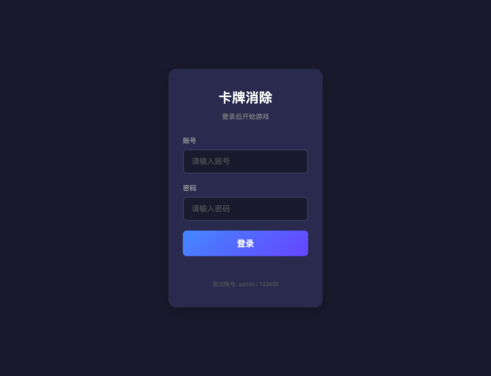
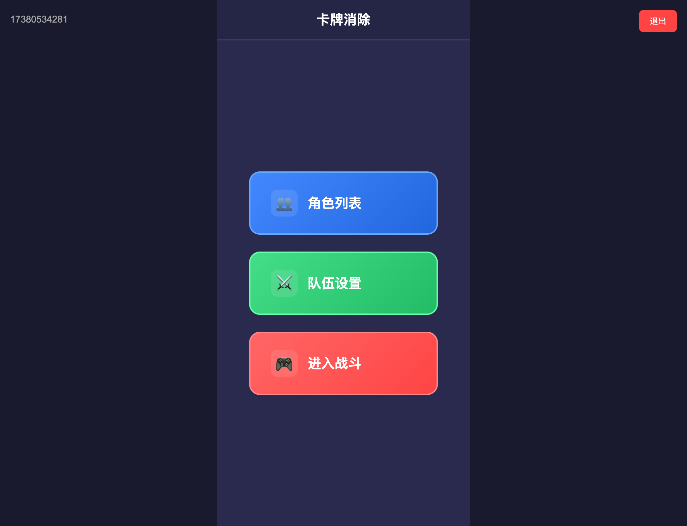
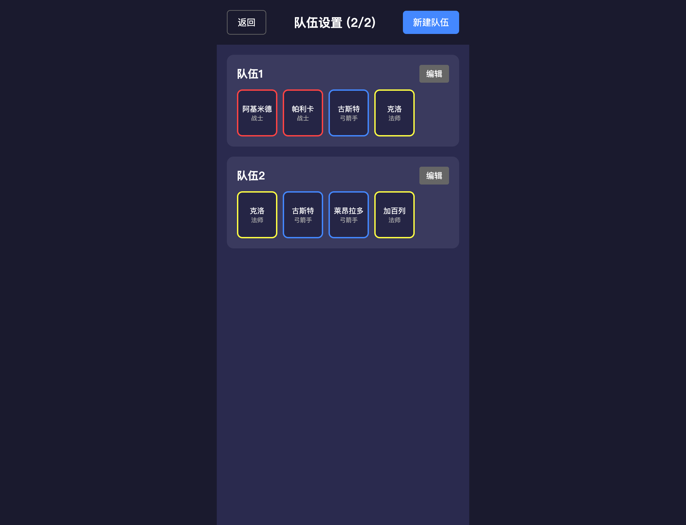
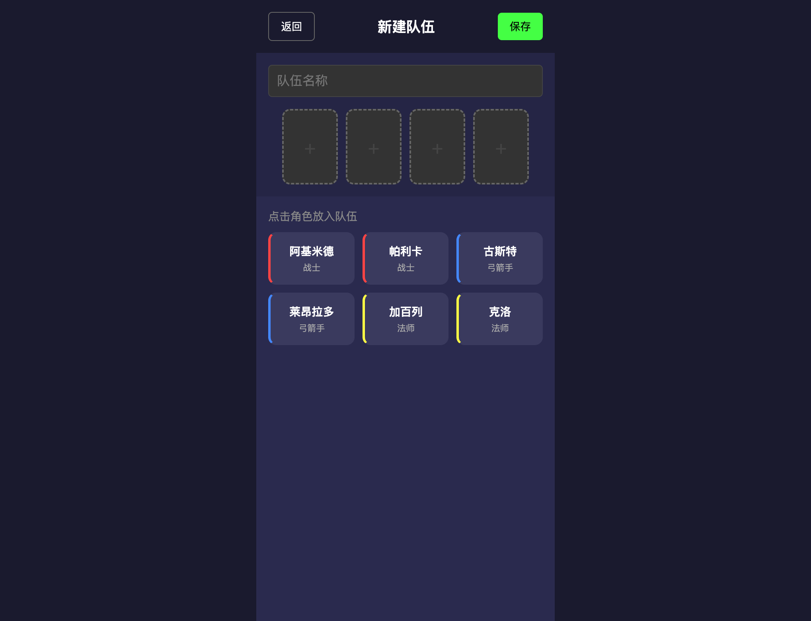
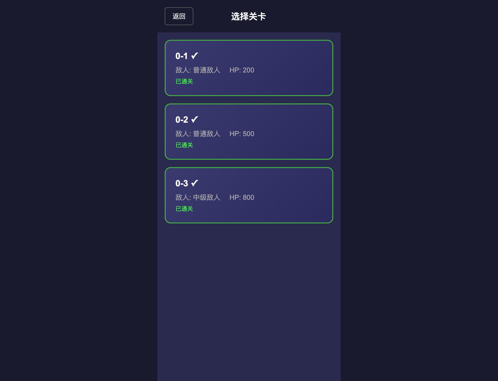
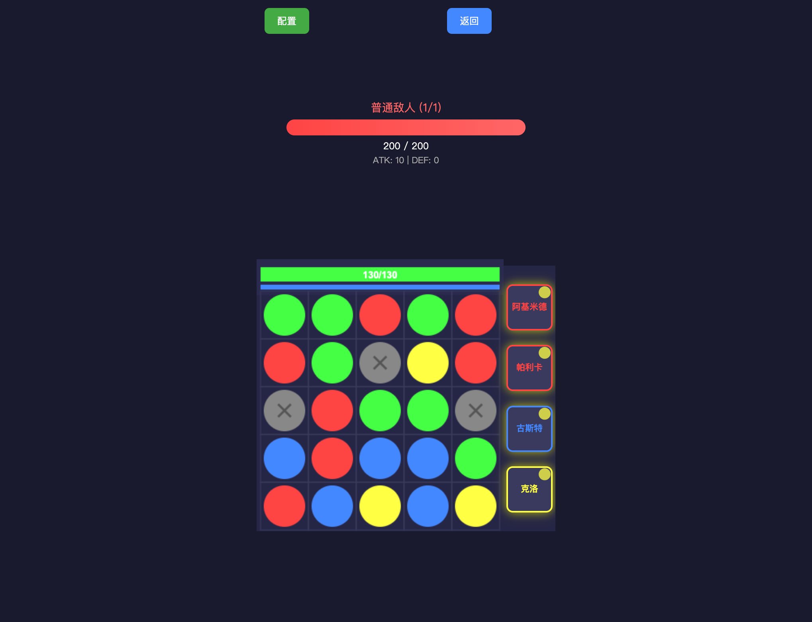

[English](./README_en.md) | 中文

# 卡牌三消游戏 (Card Match 3)

基于 HTML5 Canvas 和原生 JavaScript 的卡牌三消对战游戏，支持多角色、多技能、多关卡 BOSS 战。

## 截图








## 项目结构

```
cardgame/
├── front/                     # 前端 (原生 JS + HTML5 Canvas + Vite)
│   ├── common/               # 公共模块
│   │   ├── auth.js           # 认证 & API 封装
│   │   ├── common.css       # 全局样式 & 布局
│   │   └── utils.js          # 工具函数 (XSS转义、loading等)
│   ├── game/                 # 游戏核心模块
│   │   ├── config.js        # 战斗配置计算
│   │   ├── main.js           # 游戏入口
│   │   ├── objects/          # 游戏对象
│   │   │   └── Board.js      # 棋盘逻辑 (创建、匹配、掉落)
│   │   ├── scenes/           # 场景
│   │   │   └── BattleScene.js # 战斗场景 (渲染、交互、技能)
│   │   └── utils/            # 工具
│   │       ├── constants.js  # 常量 (颜色、类型、尺寸)
│   │       └── helpers.js    # 辅助函数
│   ├── index.html            # 战斗页面
│   ├── login.html            # 登录页面
│   ├── main.html             # 主菜单
│   ├── characters.html        # 角色列表
│   ├── team.html             # 队伍列表
│   ├── team-edit.html        # 编辑队伍
│   ├── team-select.html      # 选择队伍
│   ├── level-select.html     # 选择关卡
│   ├── package.json
│   └── vite.config.js
├── server/                   # 后端 (Python FastAPI)
│   ├── main.py              # API 接口
│   ├── database.py          # 数据库操作
│   ├── init_database.sql     # 数据库初始化
│   ├── init_levels.sql       # 关卡数据
│   └── requirements.txt
└── AGENTS.md                 # 开发规范文档
```

## 快速启动

### 1. 启动 MySQL

```bash
brew services start mysql
```

### 2. 启动 Redis

```bash
brew services start redis
```

### 3. 初始化数据库

```bash
cd server
mysql -uroot -p12345678 Game < init_database.sql
mysql -uroot -p12345678 Game < init_levels.sql
```

### 4. 启动后端

```bash
cd server
pip install -r requirements.txt
uvicorn main:app --host 127.0.0.1 --port 8090
```

### 5. 启动前端

```bash
cd front
npm install
npm run dev      # 开发模式，访问 http://localhost:8080
npm run build    # 生产构建
```

## 游戏玩法

- **核心机制**: 5×5 棋盘，滑动交换相邻珠子触发三消
- **珠子类型**: 红色(战士)、蓝色(弓箭手)、绿色(回复)、黄色(法师)、灰色(无效)
- **战斗流程**: 滑动 → 计时开始 → 三消连锁 → 伤害/回复计算 → 珠子掉落 → 重复
- **技能系统**: 每个角色有被动技能和主动技能，主动技能可在战斗中手动释放
- **关卡设计**: 多波次敌人，BOSS 战

## 技术栈

- **前端**: 原生 JavaScript (ES6+)、HTML5 Canvas、Vite
- **后端**: Python FastAPI、MySQL、Redis
- **通信**: REST API + JWT Token

## 代码规范

| 类型 | 规范 | 示例 |
|------|------|------|
| 类名 | PascalCase | `Game`, `Board` |
| 常量 | UPPER_SNAKE_CASE | `GRID`, `CELL` |
| 变量/函数 | camelCase | `isDragging`, `createBoard()` |
| CSS 类名 | kebab-case | `game-container` |
| 缩进 | 4 空格 | — |

## 测试账号

- 用户名: `xcl1989`
- 密码: `123456`
